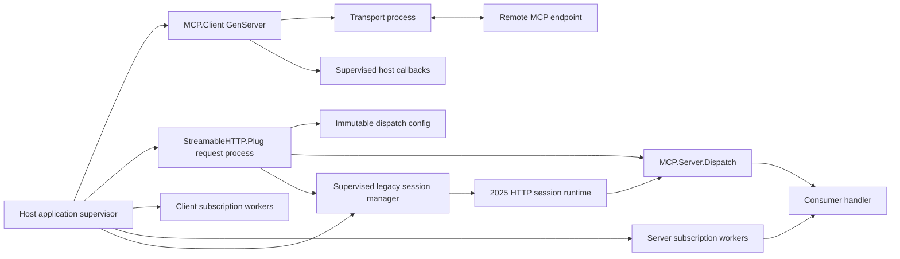
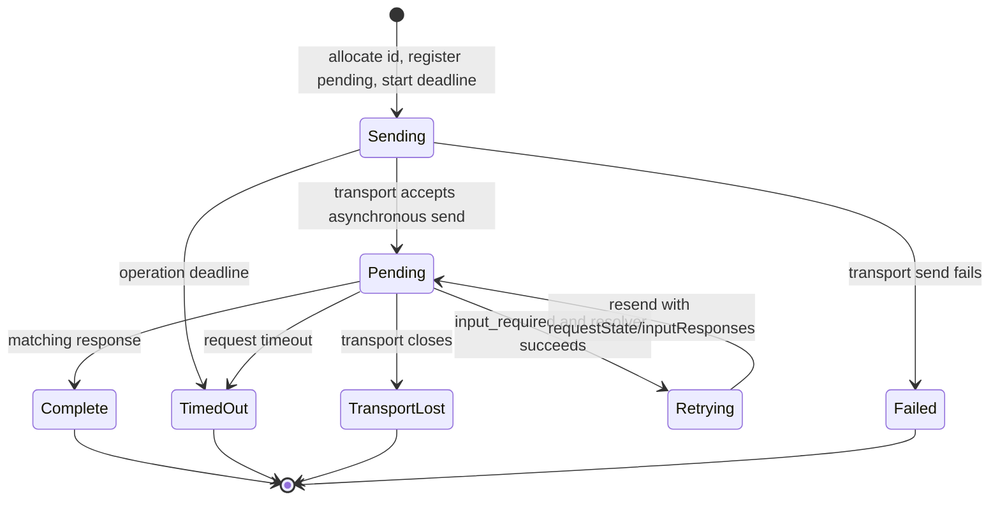
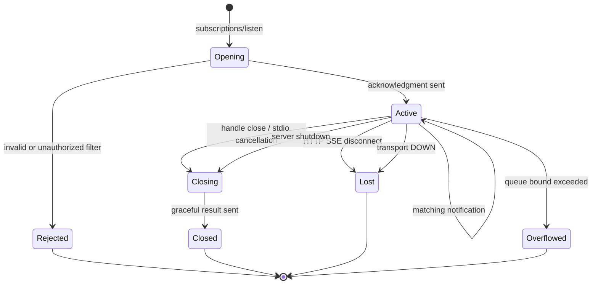

# MCP Elixir SDK 2.0 Runtime Models

**Status:** Normative 2.0 target with current defects called out
**Scope:** OTP ownership, state, concurrency, and failure recovery

This SDK has no database-backed models. Its “models” are protocol structs
described in [types.md](types.md) and runtime state/lifecycle objects described
here. Adding Ecto schemas, durable jobs, or a database is outside the 2.0 SDK
scope.

## Runtime topology



The library application supervises the default legacy HTTP session manager.
Consumers own their client/server and subscription processes through their own
supervision trees. Tests start custom runtime owners with `start_supervised!/1`
so ownership and cleanup are deterministic.

## M1 — Client process

`MCP.Client` is a GenServer that owns request correlation and the transport.
Its important current state is:

```elixir
%MCP.Client{
  transport_module: module(),
  transport_pid: pid(),
  client_info: MCP.Protocol.Types.Implementation.t(),
  client_capabilities: MCP.Protocol.Capabilities.ClientCapabilities.t(),
  protocol_version: "2026-07-28" | "2025-11-25",
  status: :ready | :closed,
  server_capabilities: map() | nil,
  server_info: map() | nil,
  pending_requests: %{request_id() => pending_request()},
  next_id: pos_integer(),
  request_timeout: timeout(),
  notification_handler: function() | nil,
  on_input_required: function() | nil
}
```

In 2026 mode, `connect/2` performs optional discovery and ordinary requests are
valid without a session. In 2025 mode it owns initialize/initialized state,
negotiated capabilities, and server-request handlers. Automatic selection is a
single bounded transition from preferred discovery to legacy initialize.

### Implemented lifecycle invariants

The 2.0 implementation installs pending state and its absolute deadline before
transport I/O. Streamable HTTP POSTs run in supervised, caller-monitored tasks,
so a timed-out request is cancelled without blocking the transport GenServer or
later requests. MRTR resolvers and function notification handlers also run
outside the client GenServer; notification execution has a configurable bounded
concurrency limit.

### Target request lifecycle



Each pending entry owns the original `GenServer.from`, one absolute operation
deadline, and its continuation. It is installed before transport I/O. The same
deadline covers transmission, response waiting, callback resolution, and MRTR
retries; retrying does not reset it. A terminal response or failure removes it
exactly once. Late transport/callback results are ignored by operation token.

Function callbacks run under SDK-owned task supervisors. MRTR tasks are
monitored and bounded by the remaining operation deadline; notification tasks
have bounded admission. Callback exception,
timeout, client cancellation, or transport loss cancels the task and resolves
the pending call without blocking or crashing the client GenServer. Pid-based
notification delivery remains an ordinary non-blocking `send/2`.

## M2 — Streamable HTTP client transport

`MCP.Transport.StreamableHTTP.Client` owns endpoint configuration and response
delivery:

```elixir
%MCP.Transport.StreamableHTTP.Client{
  owner: pid(),
  url: String.t(),
  protocol_version: String.t(),
  extra_headers: [{String.t(), String.t()}],
  task_supervisor: pid(),
  post_tasks: %{reference() => map()},
  subscriptions: %{term() => map()}
}
```

`send_message/2` starts supervised request work without performing `Req.post/2`
inside the transport GenServer. Each task is tied to its calling process; caller
death, request timeout, transport close, and explicit subscription cancellation
reclaim the corresponding work. Workers report responses using an operation
token, and late results after cancellation are ignored.

S1 adds message-derived routing headers. The high-level client owns a bounded
LRU schema index (default 1,024 tools) or accepts an explicit call schema. The
transport receives only the selected validated header descriptors and remains
responsible for deterministic wire construction, not catalog ownership.
The HTTP server Plug owns immutable `tool_schemas` configuration, either a
precompiled static map or an identity-aware resolver evaluated after the
authenticated identity factory. This is separate from dispatch configuration
because it is an HTTP routing concern.

Long-lived subscription responses use supervised tasks. Delivery is
acknowledged end-to-end from stream parser through the client subscription
worker, so the configured queue limit also bounds upstream parsing and mailbox
growth rather than merely bounding the final worker queue.

For 2025 HTTP, the client transport also owns a supervised GET SSE listener
bound to the negotiated session ID. Closing stops the listener before issuing
a best-effort DELETE. Session expiry or exhausted listener retries are surfaced
to the owner; a terminal listener exit is never treated as continued healthy
delivery.

## M2a — Legacy HTTP session runtime

Each `Mcp-Session-Id` maps to one `MCP.Server.Connection` and one
`LegacySession` transport under `LegacySessionManager`. The manager stores only
an authenticated-identity fingerprint, enforces endpoint and per-principal
capacity, refreshes idle activity after an authenticated lookup, and reclaims
sessions at idle or absolute expiry. The transport bounds pending POST callers,
request-scoped notifications, its SSE event queue, and the single SSE waiter.
Caller death, timeout, manager shutdown, process failure, or DELETE removes
waiters and closes both processes. Initialize failure never publishes a session
ID and closes the partially created runtime. Manager unavailability is exposed
as an operational error (HTTP 503 at the Plug boundary), not collapsed into an
empty registry, successful deletion, or session-not-found response.

## M3 — Stdio transport

`MCP.Transport.Stdio` owns either an internal Unix `erlexec` process wrapper or
an IO device plus a frame buffer. The wrapper applies environment policy,
process-group shutdown, and bounded cleanup before reporting closure. Stdio
forwards complete newline-delimited JSON messages to its owner. In S2,
subscriptions do not create new stdio channels; multiple streams are
multiplexed by JSON-RPC ID, so correlation belongs above framing.

## M4 — Immutable server configuration

`MCP.Server.Config.build/2` calls `handler.init/1` once and returns:

```elixir
%{
  handler_module: module(),
  handler_state: term(),
  server_info: MCP.Protocol.Types.Implementation.t(),
  capabilities: MCP.Protocol.Capabilities.ServerCapabilities.t(),
  instructions: String.t() | nil,
  protocol_version: "2026-07-28",
  cache_defaults: {non_neg_integer(), String.t()}
}
```

Per [ADR-004](../adr/0004-immutable-handler-launch-configuration.md), this map
is immutable request-independent configuration. `handler_state` is
renamed to `handler_config` during the S5 API migration; it is the launch value
returned by `init/1`, not state threaded through requests. Callback return
values cannot replace it. If a consumer requires mutable data, it owns a
separately supervised process and keeps only a reference/name in the launch
configuration.

## M5 — Per-request context

`MCP.Server.ToolContext` is ephemeral and is constructed by the transport before
dispatch:

```elixir
%MCP.Server.ToolContext{
  request_id: term(),
  meta: map() | nil,
  identity: term() | nil,
  input: %{request_state: binary(), responses: term()} | nil,
  reply_sink: (String.t(), map() -> :ok) | nil
}
```

Ownership rules:

- `identity` belongs to the authenticated transport pipeline.
- `input` belongs to the MRTR continuation for this request.
- `reply_sink` belongs to this request's outbound response channel.
- Nothing in `ToolContext` may be cached and reused for another request.
- A handler may retain application data derived from a request only under its
  own explicit security and lifecycle policy; that is outside the SDK context.

## M6 — Stateless dispatch

`MCP.Server.Dispatch` is a synchronous, per-message router. It validates
protocol metadata, selects a context-bearing callback, shapes success/error
results, and returns a response without replacement state. It is not a GenServer and owns no
mailbox, timers, sockets, or supervision children.

This separation is load-bearing: transport processes own I/O; dispatch owns
protocol decisions; consumer handlers own domain behavior.

## M7 — Planned subscription supervisor

Per [ADR-005](../adr/0005-consumer-owned-subscription-supervision.md), S2
introduces long-lived state that does not fit ordinary request dispatch.
Subscriptions require a consumer-supplied named `DynamicSupervisor` (or pid);
the SDK does not create a global singleton. Client and server workers are
different child types:

```text
Consumer supervisor
└── MCP subscription supervisor (DynamicSupervisor, supplied in options)
    ├── Client consumer worker {client, request_id A}
    ├── Client consumer worker {client, request_id B}
    └── Server stream worker {endpoint, request_id C}

Server registry
└── {endpoint, request_id C} -> server worker + honored filter
```

Server publication uses a consumer-supplied named `Registry` (or pid). Client
workers are addressed only through opaque handles and are not registered in the
server publication registry.

### Server subscription worker state

```elixir
%Subscription{
  id: request_id(),
  transport: :stdio | :streamable_http,
  owner: pid(),
  identity: term() | nil,
  requested: MCP.Protocol.Types.SubscriptionFilter.t(),
  honored: MCP.Protocol.Types.SubscriptionFilter.t(),
  status: :opening | :active | :closing,
  queue_limit: pos_integer(), # default 256
  monitor_ref: reference() | nil
}
```

The server worker stores identity only for authorizing/filtering its already-open
stream; it must never lend that identity to another request. It monitors the
transport/owner and terminates when the channel disappears.

### Client subscription worker and handle

The client worker owns the HTTP response body/SSE parser or stdio correlation
buffer, a bounded 256-event queue by default, and the subscription request ID.
The public `MCP.Client.SubscriptionHandle` holds only its ID, worker pid, and
monitor. `next/2` consumes one event; `close/1` is idempotent and maps to SSE
stream closure on HTTP or `notifications/cancelled` on stdio.

### Subscription state machine



The acknowledgment transition is atomic from the server worker's perspective: no
publisher may deliver to the worker until it is registered as active after the
acknowledgment has been queued/sent.

## M8 — Notification publication

Consumer code needs one internal publication seam, conceptually:

```elixir
publish(notification_method, params) :: :ok
```

The publisher finds active subscriptions, filters by honored options, stamps
the subscription ID into notification `_meta`, and enqueues independently.
Publication does not wait for a slow network client. Each enqueue is bounded;
at 256 queued events by default, the next enqueue terminates only that stream
with local reason `:queue_overflow`, removes registry membership, and emits an
observable telemetry/log event. It does not synthesize a successful MCP result.

This is runtime machinery, not a new public MCP method.

## Supervision and recovery contracts

| Failure | Restart/propagation policy |
| --- | --- |
| Ordinary request handler raises | Fail request; transport process remains available where safe |
| Client transport exits | Client resolves all pending calls with transport-closed and becomes closed |
| One subscription worker exits | Remove registration; do not terminate siblings |
| Subscription owner/HTTP connection exits | Worker terminates normally after cleanup |
| Registry/supervisor exits | Consumer supervision strategy restarts infrastructure; existing network streams are considered lost |
| Handler-owned state process exits | Consumer policy; SDK returns handler/domain failures until restored |
| Host callback task raises/times out | Resolve affected operation; client and siblings remain alive |

## Test synchronization

Runtime tests must use causal synchronization:

- `start_supervised!/1` for every process owned by a test.
- `Process.monitor/1` and `assert_receive {:DOWN, ...}` for termination.
- `_ = :sys.get_state(pid)` when a prior message must be processed before an
  assertion.
- No `Process.sleep/1` or `Process.alive?/1` as correctness evidence.

## Fixed S2 runtime decisions

1. Consumers supply the subscription `DynamicSupervisor`; servers also supply
   the publication registry. There is no SDK-global process.
2. The public client API is an opaque handle with `next/2` and `close/1`.
3. Client and server queues default to 256 and accept a positive configured
   bound; overflow is local `:queue_overflow` plus stream termination.
4. HTTP cancellation is SSE response-stream closure. Stdio cancellation is
   `notifications/cancelled`.
5. Client-consumer and server-stream workers are separate modules and states.

## Current implementation anchors

- Client GenServer state and API: [`client.ex:56`](../../lib/mcp/client.ex#L56)
- Streamable HTTP transport state:
  [`client.ex:35`](../../lib/mcp/transport/streamable_http/client.ex#L35)
- Stdio transport state: [`stdio.ex:35`](../../lib/mcp/transport/stdio.ex#L35)
- Immutable server configuration:
  [`config.ex:68`](../../lib/mcp/server/config.ex#L68)
- Per-request context:
  [`tool_context.ex:47`](../../lib/mcp/server/tool_context.ex#L47)
- Stateless dispatch entry point:
  [`dispatch.ex:60`](../../lib/mcp/server/dispatch.ex#L60)
